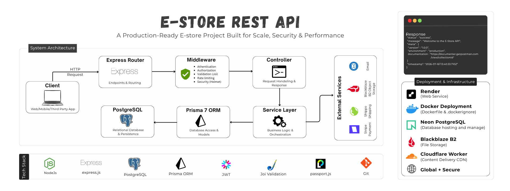
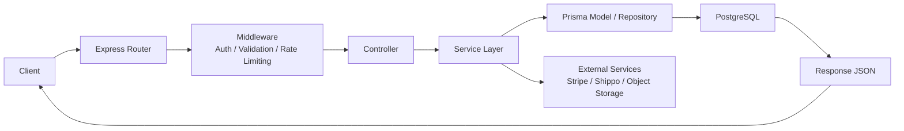
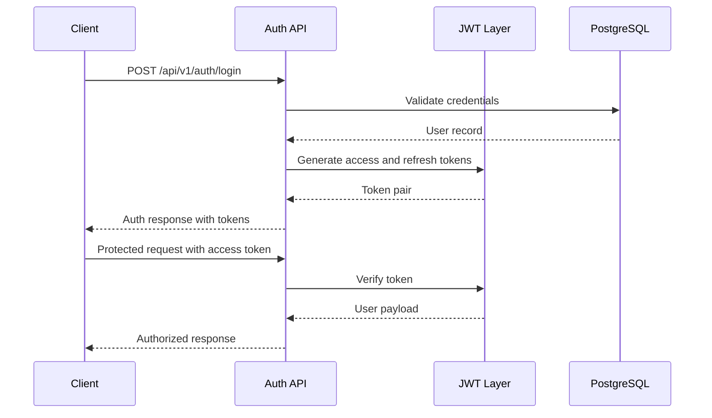
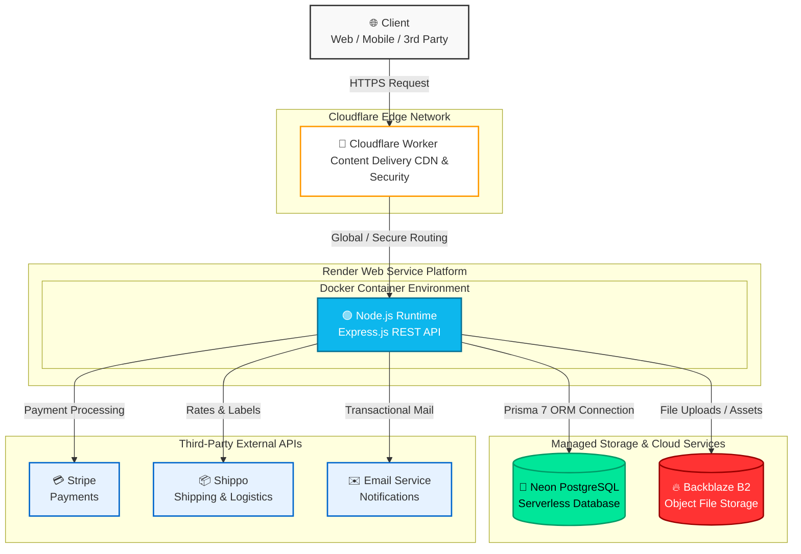

# Estore REST API

> A production-oriented e-commerce backend built for comprehensive catalog management, customer commerce, administrative operations, payments, fulfillment, and business analytics.



## Badges


## Table of Contents

- [Project Overview](#project-overview)
- [Business Problem](#business-problem)
- [Features](#features)
- [Tech Stack](#tech-stack)
- [Architecture](#architecture)
- [Folder Structure](#folder-structure)
- [Database Design](#database-design)
- [Business Logic](#business-logic)
- [API Modules](#api-modules)
- [Authentication and Authorization](#authentication-and-authorization)
- [Security](#security)
- [Validation](#validation)
- [Error Handling](#error-handling)
- [API Response Format](#api-response-format)
- [Environment Variables](#environment-variables)
- [Installation](#installation)
- [Running Locally](#running-locally)
- [Deployment](#deployment)
- [Performance Optimizations](#performance-optimizations)
- [Scalability](#scalability)
- [Sample API Requests](#sample-api-requests)
- [Future Improvements](#future-improvements)
- [Author](#author)
- [License](#license)

## Project Overview

This repository implements a robust backend for an online store that extends far beyond basic CRUD operations. It provides comprehensive support for:

- Customer-facing shopping workflows
- Administrative product and category management
- Complete order lifecycle management
- Payment reconciliation
- Shipment tracking integration
- Customer reviews with moderation capabilities
- Operational dashboard analytics
- Permission-aware administrative governance

The application employs a clean layered architecture in which incoming HTTP requests flow through routes, controllers, services, and models before interacting with PostgreSQL via Prisma.

## Business Problem

Modern e-commerce platforms must simultaneously address four interconnected concerns:

1. Catalog and inventory management
2. Customer shopping experience and seamless checkout
3. Administrative operations and business oversight
4. Reliability, compliance, and operational safety

This project resolves these challenges through:

- Route-level validation and authentication
- Centralized business rule enforcement within service layers
- Relational integrity enforced by Prisma models
- Analytics capabilities for administrative operations
- Webhook-driven payment synchronization
- Background cleanup processes for operational hygiene

## Features

### Customer-Facing Features

- Customer registration and login
- Google OAuth integration
- Password reset workflow
- Active shopping cart management
- Wishlist management
- Checkout and order history access
- Address management
- Product review submission and moderation

### Admin-Centric Features

- Secure admin login with role-based access
- Granular permissions by module and action
- Comprehensive management of products, variants, images, coupons, and categories
- Order status and payment status updates
- Review moderation and approval workflows
- Dashboard with KPIs, charts, and operational alerts

### Platform Features

- Stripe webhook processing for payment events
- Backblaze B2-compatible signed upload URLs
- Shippo integration for shipment creation and tracking
- Background jobs for token cleanup and abandoned cart management
- Centralized response formatting and error handling

## Tech Stack

| Layer          | Technology                           |
| -------------- | ------------------------------------ |
| Runtime        | Node.js                              |
| Web Framework  | Express 5                            |
| ORM            | Prisma 7                             |
| Database       | PostgreSQL                           |
| Validation     | Joi                                  |
| Authentication | JWT, Passport, Google OAuth 2.0      |
| Security       | Helmet, CORS, rate limiting          |
| Storage        | AWS S3 SDK (Backblaze B2-compatible) |
| Payments       | Stripe                               |
| Shipping       | Shippo                               |
| Scheduled Jobs | node-cron                            |
| Environment    | dotenv                               |

### Technology Rationale

- **Node.js and Express** were selected for their excellent support of API-first development with extensive middleware and routing capabilities.
- **Prisma** provides type-safe, schema-driven database access that simplifies evolution and maintenance.
- **PostgreSQL** ensures strong relational consistency, indexing, transactional integrity, and support for analytical queries.
- **Joi** enforces explicit, consistent request contracts across the application.
- **JWT-based authentication** supports stateless, secure token flows (header or cookie-based).
- Layered service architecture centralizes business logic, improving maintainability and testability.
- Object storage with CDN-friendly URLs enables scalable media handling.

## Architecture

The application follows a standard layered pattern: **Route → Controller → Service → Model → Database**.



### Request Lifecycle

1. Requests enter the Express application.
2. Global middleware manages security headers, body parsing, and CORS.
3. Route-specific middleware handles authentication, permission checks, and Joi validation.
4. Controllers delegate business operations to dedicated services.
5. Services enforce rules and interact with Prisma models or external providers.
6. Responses are returned using a consistent JSON envelope.

### Middleware Order

- Global JSON/body parsing
- Cookie parsing
- Security headers (production)
- CORS configuration
- Passport initialization
- Route-level authentication and permission-based access control (PBAC)
- Joi validation
- Controller execution
- Global error handling

### Error Handling Flow

All errors are centralized through custom `AppError` classes and global error-handling middleware, ensuring consistent and predictable failure responses.

## Folder Structure

```text
src/
  app.js
  core/
    configs/
    jobs/
    middlewares/
    templates/
    utils/
  modules/
    auth/
    admin/
    address/
    cart/
    categories/
    countries/
    coupons/
    customer/
    dashboard/
    orders/
    payment/
    permissions/
    products/
    reviews/
    shipments/
    uploads/
    wishlist/
prisma/
  schema.prisma
  migrations/
```

### Structure Rationale

- `core/` houses reusable infrastructure components (middleware, configuration, jobs, utilities).
- `modules/` organizes feature-specific code (routes, controllers, services, validation, models) following vertical slice architecture.
- This separation isolates business domains while promoting shared infrastructure reuse.

## Database Architecture & Design

The Prisma schema models the complete e-commerce domain with strong relational integrity.

### Main Entity Groups

- **Users & Permissions**: `customers`, `admins`, `permissions`, `admin_permissions`
- **Catalog**: `categories`, `products`, `product_variants`, `product_images`
- **Commerce**: `carts`, `cart_items`, `orders`, `order_items`, `payments`, `shipments`
- **Promotions & Feedback**: `coupons`, `reviews`, `wishlists`
- **Utility**: `PasswordReset`, `refresh_tokens`, `countries`, `customer_auth_providers`

### ER Diagram

```mermaid
erDiagram
    %% --- ADMIN & PERMISSIONS SUB-SYSTEM ---
    admins {
        Uuid id PK
        VarChar name
        VarChar email UK
        String password_hash
        VarChar role
        Boolean is_active
        Uuid created_by FK
        Timestamp created_at
        Timestamp deleted_at
        VarChar phone_number UK
    }
    admin_permissions {
        Uuid id PK
        Uuid admin_id FK
        Int permission_id FK
        Uuid granted_by FK
        Timestamp granted_at
    }
    permissions {
        Int id PK
        VarChar name UK
        String description
        VarChar module
        Timestamp created_at
    }

    %% --- CUSTOMER SUB-SYSTEM ---
    customers {
        Uuid id PK
        VarChar first_name
        VarChar last_name
        VarChar email UK
        VarChar phone UK
        String password_hash
        Boolean is_active
        Timestamp created_at
        Timestamp deleted_at
    }
    customer_auth_providers {
        String id PK
        Uuid customer_id FK
        VarChar provider_id
        Timestamp created_at
        AuthProvider provider
    }
    PasswordReset {
        Uuid id PK
        Uuid customer_id FK
        String token_hash UK
        DateTime expires_at
        Boolean used
        DateTime created_at
    }
    addresses {
        Uuid id PK
        Uuid customer_id FK
        VarChar label
        String street
        VarChar city
        VarChar province
        VarChar postal_code
        Boolean is_default
        Char country_code
        VarChar country
        VarChar province_code
    }

    %% --- PRODUCT CATALOG SUB-SYSTEM ---
    categories {
        Uuid id PK
        Uuid parent_id FK
        VarChar name UK
        VarChar slug UK
        Boolean is_active
        String description
        Timestamp created_at
        Json attribute_rules
        Timestamp updated_at
    }
    products {
        Uuid id PK
        Uuid category_id FK
        VarChar name
        VarChar slug UK
        String description
        Decimal base_price
        Boolean is_active
        Timestamp created_at
        Timestamp deleted_at
    }
    product_images {
        Uuid id PK
        Uuid product_id FK
        String url
        Boolean is_primary
        Int sort_order
        VarChar alt_text
        DateTime created_at
        String key
    }
    product_variants {
        Uuid id PK
        Uuid product_id FK
        VarChar sku UK
        Decimal price
        Int stock_quantity
        Int reserved_quantity
        Int reorder_level
        Json attributes
        VarChar attributes_hash
        Timestamp deleted_at
        Decimal weight
    }

    %% --- CART & ORDER FULFILLMENT SUB-SYSTEM ---
    carts {
        Uuid id PK
        Uuid customer_id FK "UK (ACTIVE status)"
        VarChar session_id "UK (ACTIVE status)"
        Timestamp expires_at
        Timestamp updated_at
        Uuid coupon_id FK
        Timestamp created_at
        cart_status status
    }
    cart_items {
        Uuid id PK
        Uuid cart_id FK
        Uuid variant_id FK
    }
    orders {
        Uuid id PK
        Uuid customer_id FK
        VarChar guest_email
        VarChar guest_name
        VarChar guest_phone
        Uuid address_id FK
        Json guest_address
        Uuid coupon_id FK
        Decimal subtotal
        Decimal discount_amount
        Decimal shipping_cost
        Decimal total_amount
        Timestamp placed_at
        VarChar order_number UK
        OrderStatus status
        PaymentMethod payment_method
        PaymentStatus payment_status
    }
    order_items {
        Uuid id PK
        Uuid order_id FK
        Uuid variant_id FK
        Int quantity
        Decimal unit_price
        Decimal total_price
        VarChar product_name
        VarChar sku
        Json variant_options
    }
    coupons {
        Uuid id PK
        VarChar code UK
        Decimal value
        Decimal min_order_value
        Int max_uses
        Int used_count
        Boolean is_active
        Timestamp expires_at
        Timestamp created_at
        Decimal max_discount
        Timestamp starts_at
        Timestamp updated_at
        coupon_type type
    }
    payments {
        Uuid id PK
        Uuid order_id FK
        Decimal amount
        VarChar transaction_id UK
        Timestamp paid_at
        PaymentMethod method
        PaymentStatus status
    }
    reviews {
        Uuid id PK
        Uuid customer_id FK
        Uuid product_id FK
        Uuid order_id FK
        SmallInt rating
        String comment
        DateTime created_at
        DateTime approved_at
        Uuid approved_by FK
        Int helpful_count
        String rejection_reason
        ReviewStatus status
        VarChar title
        DateTime updated_at
        Boolean verified_purchase
        Uuid author_id FK
    }
    shipments {
        Uuid id PK
        Uuid order_id FK
        VarChar carrier
        VarChar tracking_number
        Timestamp shipped_at
        Timestamp delivered_at
        ShipmentStatus status
        VarChar label_url
        VarChar transaction_id
    }

    %% --- UNLINKED FACTUAL/UTILITY TABLES ---
    refresh_tokens {
        Uuid id PK
        String token_hash UK
        Uuid user_id
        VarChar user_type
        Timestamp expires_at
        Timestamp created_at
    }
    countries {
        Int id PK
        Char iso2 UK
        Char iso3 UK
        VarChar name
        VarChar phone_code
        Char currency
        VarChar flag_emoji
        Boolean is_active
        DateTime created_at
        DateTime updated_at
    }

    %% --- RELATIONSHIPS (CARDINALITY) ---
    admins ||--o{ admins : "creator / AdminHierarchy"
    admins ||--o{ admin_permissions : "admin / AdminOwnedPermissions"
    admins ||--o{ admin_permissions : "granter / AdminGrantedPermissions"
    permissions ||--o{ admin_permissions : "permission"

    customers ||--o{ customer_auth_providers : "auth_providers"
    customers ||--o{ PasswordReset : "passwordResets"
    customers ||--o{ addresses : "addresses"
    customers ||--o| carts : "carts (Active constraints)"
    customers ||--o{ orders : "orders"
    customers ||--o{ wishlists : "wishlists"
    customers ||--o{ reviews : "reviews (customer)"

    categories ||--o{ categories : "parent / CategoryHierarchy"
    categories ||--o{ products : "category"

    products ||--o{ product_images : "images"
    products ||--o{ product_variants : "variants"
    products ||--o{ wishlists : "wishlists"
    products ||--o{ reviews : "reviews (product)"

    coupons ||--o{ carts : "carts"
    coupons ||--o{ orders : "orders"

    carts ||--o{ cart_items : "items"
    product_variants ||--o{ cart_items : "cart_items"

    orders ||--o{ order_items : "items"
    orders ||--o{ payments : "payments"
    orders ||--o{ shipments : "shipments"
    orders ||--o{ reviews : "reviews (order)"

    product_variants ||--o{ order_items : "order_items"
    addresses ||--o{ orders : "orders"

    admins ||--o{ reviews : "approver / ReviewApprover"
    admins ||--o{ reviews : "author / AdminReviews"
```



### Key Database Design Decisions

#### 1. Admin & Access Control Subsystem

- **Granular RBAC (`admin_permissions`, `permissions`):** Instead of relying purely on a coarse `role` string on the `admins` table, permissions are broken down into individual operational actions (`permissions`) linked via a join table (`admin_permissions`). This enables fine-grained role-based access control across platform modules.
- **Audit Trail & Accountability (`created_by`, `granted_by`):** Self-referential foreign keys on `admins` and `admin_permissions` capture _who_ provisioned an admin account and _who_ assigned specific elevated privileges, satisfying strict security auditing requirements.
- **Soft Deletes (`deleted_at`):** Admin accounts use soft deletion to preserve historical audit trails across system action logs without breaking relational references in system logs or review approvals.

#### 2. Customer Subsystem

- **Decoupled Identity & OAuth (`customer_auth_providers`):** Authentication mechanisms are isolated from core user profiles. This design allows customers to link multiple OAuth providers (e.g., Google, Apple, GitHub) alongside traditional email/password credentials without schema changes to `customers`.
- **Flexible Address Management (`addresses`):** Customers can store multiple shipping/billing addresses with a boolean flag (`is_default`) designating the primary endpoint. Regional details are standardized via country codes and province attributes.
- **Self-Service Recovery (`PasswordReset`):** Password reset requests are decoupled into a dedicated table storing hashed tokens (`token_hash`), explicit expiration timestamps (`expires_at`), and single-use flags (`used`) to prevent replay attacks.
- **Polymorphic Token Management (`refresh_tokens`):** Rather than creating separate token tables for admins and customers, `refresh_tokens` uses a `user_type` discriminator column alongside `user_id`, handling JWT refresh lifecycles across all actor types in one central store.

#### 3. Product Catalog Subsystem

- **Nested Hierarchy (`categories.parent_id`):** A self-referential foreign key creates an adjacency list model, allowing unlimited sub-category depth (e.g., _Clothing → Men's → Outerwear_).
- **Flexible Category Metadata (`attribute_rules`):** Storing validation rules or specification templates as `Json` at the category level allows child products to declare dynamic attributes (e.g., screen size for tech, shoe size for apparel) without rigid table migrations.
- **SKU-Level Inventory Tracking (`product_variants`):** Products act purely as marketing/conceptual shells, while actual transactional entities (pricing, stock levels, reserved quantities, reorder points, physical weight, and SKUs) live on `product_variants`.
- **Attribute Hashing (`attributes_hash`):** Variant JSON blobs are accompanied by an `attributes_hash` to quickly enforce unique variant combination checks (e.g., ensuring a size "M" / color "Red" variant isn't duplicated) at the query level.
- **Independent Media Management (`product_images`):** Product media is normalized into its own table with `sort_order`, `is_primary`, and CDN storage keys (`key`), allowing multi-image galleries, re-ordering, and lazy-loading optimizations independent of core product metadata.

#### 4. Cart & Order Fulfillment Subsystem

- **State Isolation (`carts` vs. `orders`):** Carts are transient entities tied to persistent customer accounts or guest `session_id`s with automatic expiration times (`expires_at`). Separating checkout into `orders` ensures financial transactions remain immutable, ACID-compliant events isolated from shopping behavior.
- **Historical Data Immutability (`order_items`):** `order_items` duplicates data from `product_variants` (such as `product_name`, `sku`, `unit_price`, and `variant_options` JSON). If a product name changes or price shifts in the future, past order receipts remain historically accurate.
- **Guest Checkout Support (`orders.guest_*`):** Orders allow non-registered users to purchase items by storing guest contact info and an inline JSON address (`guest_address`), bypassing the need to force customer account creation prior to checkout.
- **Promotional Strategy (`coupons`):** Coupons enforce usage capping (`max_uses`, `used_count`), minimum cart threshold rules (`min_order_value`), maximum discount caps (`max_discount`), and validity windows (`starts_at`, `expires_at`).
- **Two-Phase Payment & Shipping (`payments`, `shipments`):** Order fulfillment separates financial capture (`payments`) from logistics delivery (`shipments`). An order can handle split payments, retries, tracking numbers, carrier labels, and partial or multi-package shipments without modifying the parent order status directly.
- **Verified Purchase Reviews (`reviews`):** Reviews require explicit linkage across `product_id`, `customer_id`, and `order_id`. This triplet ensures the system can strictly verify that an author actually purchased the product before marking `verified_purchase = true` and publishing the review following admin moderation (`approved_by`, `approved_at`).

## Business Logic

### Review Lifecycle

Reviews are tightly coupled to a specific product, customer, and order. This design enables verified-purchase validation and prevents fraudulent or duplicate submissions.

### Cart and Inventory Management

Cart items reference product variants directly, enabling precise SKU-level inventory checks essential for configurable products.

### Administrative Authorization

Permission-based access control (PBAC) ensures administrators can only access features aligned with their assigned permissions. A dedicated owner role provides super-user bypass capabilities.

### Coupons and Promotions

Coupons enforce value thresholds, usage limits, and temporal validity windows for consistent application.

### Orders and Payments

Order creation is decoupled from payment state transitions to safely reconcile Stripe webhook events.

### Dashboard Analytics

The dashboard aggregates real-time operational metrics across orders, customers, revenue, inventory, coupons, reviews, and categories.

## API Modules

### Authentication

- Customer and admin registration/login
- Password reset flows
- Google OAuth support
- JWT access and refresh token management

### Customer & Profile

- Profile management and storefront data access (authenticated users only)

### Products

- Catalog browsing and management (variants, images, soft deletes)

### Categories

- Hierarchical organization with slug-based routing and attribute rules

### Cart

- Guest and authenticated sessions with stock validation and coupon support

### Orders

- Placement, lookup, and status management

### Coupons

- Promotion definition and validation

### Reviews

- Submission and moderation with ownership controls

### Dashboard

- Operational KPIs and alerts

### Uploads

- Presigned URLs for secure object storage

### Countries

- Reference data for addresses and shipping (admin-managed)

## Authentication and Authorization

### Authentication Model

The API employs JWT-based authentication with refresh token support for stateless sessions. Passport.js handles Google OAuth flows.

### Authorization Model

Authorization occurs in two layers:

- **Authentication Middleware**: Validates JWT tokens and attaches user context.
- **Permission-Based Access Control (PBAC) Middleware**: Enforces granular permissions for administrative endpoints.

### Authentication Flow



## Security

Implemented security measures include:

- Production-grade Helmet security headers
- Strict CORS policies
- Comprehensive Joi request validation
- Rate limiting on sensitive endpoints
- Automatic cleanup of expired tokens and password reset records
- Stripe webhook signature verification
- Permission-based access control for administrative routes

## Validation

A centralized validation middleware applies Joi schemas to query, params, and body payloads, strips unknown fields, and returns detailed error groups. This approach keeps controllers concise while maintaining strong input contracts.

## Error Handling

Custom `AppError` classes combined with global error middleware deliver consistent, structured JSON error responses for validation failures, authorization issues, and server errors.

## API Response Format

Successful responses follow a standardized envelope:

```json
{
  "success": true,
  "message": "Operation completed successfully",
  "data": {}
}
```

Error responses are similarly structured via the centralized error handler.

## Environment Variables

The application requires configuration for database connections, JWT secrets, OAuth providers, email services, storage credentials, payment gateways, and shipping providers. Refer to `example.env` as the definitive template.

## Installation

```bash
npm install
cp example.env .env
npx prisma generate
npx prisma db push
```

## Running Locally

### Development Mode

```bash
npm run dev
```

### Production Mode

```bash
npm start
```

### Health Check

```bash
curl http://localhost:3000/health
```

## Deployment

The project is designed for deployment on any Node.js hosting platform (such as Render) with PostgreSQL and external service credentials provided via environment variables.



## Performance Optimizations

- Concurrent aggregation of dashboard metrics
- Optimized PostgreSQL queries with strategic indexing
- Transactional boundaries for atomic operations
- Rate limiting on resource-intensive endpoints
- Cursor-based pagination where applicable

## Scalability

The current monolith design cleanly separates domain modules while centralizing infrastructure concerns, providing a solid foundation for future decomposition into microservices if business requirements evolve.

## Sample API Requests

### 1. Customer Login

**POST** `/api/v1/auth/login`

**Request Body**

```json
{
  "email": "ahmad1233@gmail.com",
  "password": "ahmads-pass"
}
```

**Success Response**

```json
{
  "success": true,
  "message": "Login successfully.",
  "customer": { ... },
  "accessToken": "..."
}
```

### 2. Create Product (Admin Only)

**POST** `/api/v1/admin/products`

**Request Body**

```json
{
  "name": "Product Name",
  "category_id": "uuid",
  "base_price": 99.99,
  "description": "Product description",
  "variants":[...],
  "images":[...]
}
```

**Success Response**

```json
{
  "success": true,
  "message": "Product created successfully.",
  "product": { ... }
}
```

### 3. Place Order

**POST** `/api/v1/orders`

**Request Body**

```json
// For Guest Customer:
{
  "guest_name": "Ali",
  "guest_email": "ali123@gmail.com",
  "guest_phone": "+923338863166",
  "guest_address": {
    "country_code": "PK",
    "province_code": "PB",
    "city": "Narowal",
    "street": "Al-Raheem Garden, Street No. 1",
    "apartment": "House Ho. 9",
    "postal_code": "51600"
  },
  "payment_method": "CARD"
}

// For Auth Customer:
{
  "address_id":"uuid",
  "payment_method":"CASH_ON_DELIVERLY"
}
```

**Success Response**

```json
{
  "success": true,
  "message": "Order placed successfully.",
  "data": { ... },
}
```

### 4. Admin Dashboard

**GET** `/api/v1/admin/dashboard`

**Success Response**

```json
{
  "success": true,
  "message": "Dashboard data retrieved successfully",
  "data": {
    "sales": {},
    "orders": {},
    "customers": {},
    "products": {},
    "inventory": {},
    "reviews": {},
    "coupons": {},
    "categories": {}
  }
}
```

## Postman Collection

For the complete collection with all endpoints, request examples, and environment variables, please refer to the official Postman documentation:

→ **[Open Postman Collection](https://documenter.getpostman.com/view/50005120/2sBY4MtfmC)**

---

## Future Improvements

- Enhanced observability with structured logging
- Queue-based asynchronous processing for external integrations
- Comprehensive unit and integration test suite
- CI/CD pipelines and automated deployment workflows

## Author 👨‍💻

**Muhammad Ahmad**

Backend Software Developer passionate about building scalable, production-ready REST APIs with Node.js enviroment. Learning Scalable Systems & Architecture.

- **Email:** [m.ahmad.devio@gmail.com](mailto:m.ahmad.devio@gmail.com)
- **GitHub:** https://github.com/m-ahmad-dev
- **LinkedIn:** https://www.linkedin.com/in/muhammad-ahmad-6b6967300
- **Resume/CV:** [View](https://drive.google.com/file/d/1jTS74tjrai54ji8lws7OzyJ9z-nL4ALu/view)
- **Portfolio:** _Coming Soon_

## License

This project is licensed under the ISC license.
